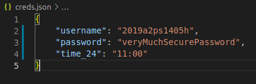

# LMS Attendance Marker

Automatic script for lazy people to mark attendance on LMS for Practice School 1.

## Setup
Add your LMS credentials and time slot to ```creds.json``` \


## Installation
Run the following to meet the requirements:
`
$ pip install -r requirements.txt
`

- Make sure ```selenium``` and Chrome Webdriver are properly installed.
- If you wish to use any other webdriver, you may change the script accordingly

## Run
Run the following command to start:
`
$ python3 attendance.py
`

## Quick FAQs
If you are a first time ```selenium``` user, there might be some errors due to missing dependencies. You may google them and solve.
